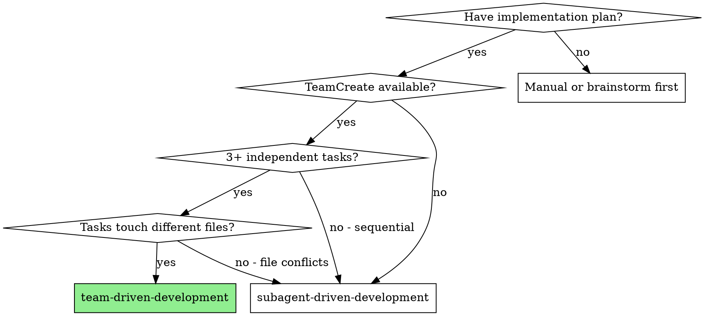
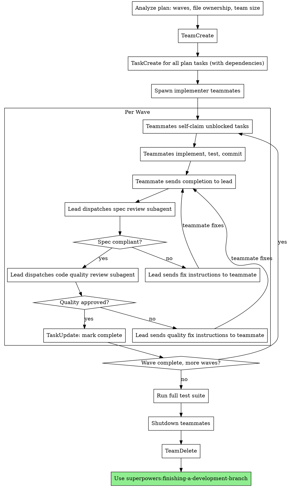

# Team-Driven Development

Execute plan by spawning persistent implementer teammates that work in parallel, with fresh subagent reviews after each task completion.

**Why teams:** Teammates are full Claude Code sessions with persistent context. They accumulate codebase knowledge across tasks, claim work from a shared task list, and work simultaneously on independent tasks. This is faster than sequential subagent dispatch when the plan has parallelizable work.

**Why subagent reviews:** Reviewers should have fresh context — no bias, no assumptions from watching the implementation unfold. A fresh subagent catches what a persistent teammate would miss.

**Core principle:** Persistent teammates implement in parallel + fresh subagents review each task = speed without sacrificing quality.

## When to Use



**Use when:**
- Plan has 3+ tasks that can run in parallel
- Tasks touch different files (no overlapping file ownership)
- Tasks are grouped into dependency-based waves
- Speed matters and you want concurrent implementation

**Don't use when:**
- Tasks are tightly coupled or sequential
- Tasks share the same files
- Plan has fewer than 3 parallelizable tasks
- TeamCreate is not available (experimental feature)

**vs. subagent-driven-development:**
- Parallel vs. sequential implementation
- Persistent vs. fresh implementer context
- Teammates accumulate codebase knowledge
- Higher token cost, faster wall-clock time

## Pre-Flight

Before creating the team, analyze the plan:

### 1. Group Tasks Into Waves

Read the plan and identify dependencies. Tasks with no unmet dependencies form Wave 1. Tasks that depend on Wave 1 form Wave 2, etc.

```
Wave 1: Tasks 1, 2, 3 (no dependencies, can run in parallel)
Wave 2: Tasks 4, 5 (depend on Task 1 and Task 2)
Wave 3: Task 6 (depends on Task 4)
```

### 2. Map File Ownership

For each wave, check that concurrent tasks don't touch the same files. Use the plan's "Files:" sections.

```
Wave 1:
  Task 1 owns: src/auth.py, tests/test_auth.py
  Task 2 owns: src/api.py, tests/test_api.py
  Task 3 owns: src/models.py, tests/test_models.py
  Overlap: NONE — safe to parallelize
```

**If overlap detected:** Move one of the conflicting tasks to the next wave. Serial is better than broken.

### 3. Determine Team Size

```
team_size = min(max_wave_width, 3)
```

- Max 3 implementer teammates (more adds coordination overhead without proportional speedup)
- If widest wave has 2 tasks, spawn 2 teammates
- If widest wave has 5+ tasks, still spawn 3 (tasks queue in the shared list)

### 4. Fitness Check

**Fall back to subagent-driven-development if:**
- Fewer than 3 total parallelizable tasks across all waves
- Most waves have width 1 (plan is inherently sequential)
- Heavy file overlap that can't be resolved by reordering

Announce: "Plan is mostly sequential — using subagent-driven-development instead."

## The Process



## Step-by-Step

### Step 1: Create Team

```
TeamCreate:
  team_name: "<feature-name>"
  description: "Implementing <feature> — <N> tasks across <M> waves"
```

### Step 2: Create Shared Tasks

Create all tasks upfront with dependencies so teammates can self-claim as work unblocks:

```
TaskCreate:
  title: "Task 1: <name>"
  description: "<full task text from plan>"

TaskCreate:
  title: "Task 2: <name>"
  description: "<full task text from plan>"
  dependencies: [task-1-id]  # if Task 2 depends on Task 1
```

### Step 3: Spawn Implementer Teammates

Spawn 2-3 implementer teammates using the template at `./implementer-teammate-prompt.md`.

Each teammate gets:
- The full plan context (architecture, tech stack, conventions)
- Their file ownership constraints
- Instructions to claim tasks from the shared list
- Instructions to use TDD and provide mandatory evidence

**Spawn via Agent tool** with `team_name` and `name` parameters:
```
Agent:
  team_name: "<feature-name>"
  name: "implementer-1"
  prompt: [filled template from ./implementer-teammate-prompt.md]
```

### Step 4: Coordinate Waves

As teammates complete tasks and send messages:

1. **Receive completion message** — teammate reports what they built with mandatory evidence
2. **Dispatch spec review subagent** (fresh, using subagent-driven-development/spec-reviewer-prompt.md)
   - Provide: full task spec, implementer's report, file paths
   - Reviewer must provide per-requirement file:line citation table
3. **If spec issues:** SendMessage to the teammate with specific fix instructions. Teammate fixes and re-reports. Re-review. Max 3 cycles.
4. **Dispatch code quality review subagent** (fresh, using subagent-driven-development/code-quality-reviewer-prompt.md)
   - Provide: BASE_SHA, HEAD_SHA, task description
5. **If quality issues:** SendMessage to the teammate. Same re-review loop. Max 3 cycles.
6. **If approved:** TaskUpdate to mark complete. Teammate claims next unblocked task automatically.
7. **If 3 review cycles exhausted:** Escalate to human with full rejection history.

### Step 5: Complete

After all tasks in all waves are done:

1. **Run full test suite** — verify everything works together
2. **Shutdown teammates:**
   ```
   SendMessage:
     target: "implementer-1"
     type: "shutdown_request"
   ```
   Repeat for each teammate. Wait for shutdown responses.
3. **TeamDelete** — clean up team resources
4. **Use superpowers:finishing-a-development-branch**

## File Conflict Prevention

This is the single biggest risk with parallel implementation. Enforce these rules:

1. **Map file ownership from the plan** before spawning teammates. Each task's "Files:" section defines what it owns.
2. **Include ownership in teammate spawn prompt:** "You own these files: [list]. Do NOT edit files outside your scope."
3. **If a teammate needs to edit a file outside its scope:** It must send a message to the lead explaining why. Lead decides whether to reassign or serialize.
4. **If overlap is detected at planning time:** Move one task to the next wave. Don't gamble on "they probably won't conflict."

## Handling Teammate Status

Teammates send plain text messages. Interpret these statuses:

**Task complete (with evidence):** Proceed to spec review.

**Concerns flagged:** Read concerns before reviewing. If about correctness or scope, address first. If observational, note and proceed.

**Blocked:** Assess the blocker:
1. Missing context → SendMessage with additional information
2. Task too complex → Break into sub-tasks, reassign
3. File conflict → Serialize with the conflicting teammate
4. Plan is wrong → Escalate to human

**Idle notification:** Normal — teammate finished its turn and is waiting. Send a message to wake it up with new work or instructions.

## Prompt Templates

- `./implementer-teammate-prompt.md` — Teammate spawn prompt
- `../subagent-driven-development/spec-reviewer-prompt.md` — Spec review (dispatched as fresh subagent)
- `../subagent-driven-development/code-quality-reviewer-prompt.md` — Quality review (dispatched as fresh subagent)

## Example Workflow

```
You: I'm using Team-Driven Development to execute this plan.

[Read plan: docs/superpowers/plans/2026-03-13-auth-module.md]
[Analyze: 6 tasks, 3 waves]
  Wave 1: Tasks 1, 2, 3 (independent, different files)
  Wave 2: Tasks 4, 5 (depend on 1, 2)
  Wave 3: Task 6 (depends on 4)
[Team size: 3 (wave 1 width)]
[File ownership: no overlaps in any wave]

[TeamCreate: "auth-module"]
[TaskCreate x6 with dependencies]
[Spawn 3 implementer teammates]

--- Wave 1 (parallel) ---

Implementer-1: Claims Task 1, implements JWT token generation
  → Reports DONE with test output + diff stat
  → [Dispatch spec reviewer] → PASS with citations
  → [Dispatch quality reviewer] → PASS
  → TaskUpdate: complete

Implementer-2: Claims Task 2, implements session storage
  → Reports DONE with evidence
  → [Dispatch spec reviewer] → ISSUE: missing TTL config
  → SendMessage to implementer-2: "Add TTL configuration per spec requirement 3"
  → Implementer-2 fixes, re-reports
  → [Dispatch spec reviewer] → PASS
  → [Dispatch quality reviewer] → PASS
  → TaskUpdate: complete

Implementer-3: Claims Task 3, implements password hashing
  → Reports DONE with evidence
  → [Dispatch spec reviewer] → PASS
  → [Dispatch quality reviewer] → Minor: magic number for salt rounds
  → SendMessage: "Extract SALT_ROUNDS constant"
  → Fix, re-review → PASS
  → TaskUpdate: complete

--- Wave 2 (parallel) ---

[Tasks 4, 5 unblock automatically]
Implementer-1: Claims Task 4 (login endpoint, depends on JWT + sessions)
Implementer-2: Claims Task 5 (registration endpoint, depends on sessions + hashing)

[Same review cycle...]

--- Wave 3 ---

[Task 6 unblocks]
Implementer-1: Claims Task 6 (integration tests)

[Review...]

--- Complete ---

[Run full test suite: 47/47 pass]
[Shutdown all teammates]
[TeamDelete]
[finishing-a-development-branch]
```

## Advantages

**vs. subagent-driven-development:**
- Wave 1 (3 tasks) completes in wall-clock time of 1 task, not 3
- Teammates retain codebase context across tasks (no re-discovery)
- Teammates can be redirected mid-work via SendMessage

**vs. manual parallel sessions:**
- Automated task coordination via shared TaskList
- Structured review gates prevent quality degradation
- Clean lifecycle (create → work → shutdown → cleanup)

**Cost tradeoff:**
- Higher token cost (each teammate is a full session)
- Significantly faster wall-clock time for parallelizable plans
- Review cost is the same (fresh subagents either way)

## Red Flags

**Never:**
- Spawn more than 3 implementer teammates (diminishing returns, coordination overhead)
- Skip the pre-flight parallelizability analysis
- Allow teammates to edit files outside their ownership scope
- Skip reviews because "teammates are persistent so they must be right"
- Let teammates review each other's work (no fresh perspective)
- Proceed with unfixed review issues
- Skip the full test suite run before shutdown
- Force a sequential plan into team mode (use subagent-driven-development instead)

**If teammate goes idle:**
- This is normal. Send a message to assign new work or acknowledge completion.
- Do NOT treat idle as an error or spawn a replacement.

**If file conflict occurs at runtime:**
- Stop both teammates working on the conflicting files
- Determine which teammate should own the file
- SendMessage to the other: "Stop editing X, teammate Y owns it"
- If damage done: `git checkout` the file from the correct teammate's last commit

**If review cycles exceed 3:**
- Escalate to human with full history
- Do NOT force approval
- Consider whether the task needs to be broken down further

## Integration

**Required workflow skills:**
- **superpowers:using-git-worktrees** — REQUIRED: Set up isolated workspace before starting
- **superpowers:writing-plans** — Creates the plan this skill executes (with dependency annotations)
- **superpowers:requesting-code-review** — Code review template for reviewer subagents
- **superpowers:finishing-a-development-branch** — Complete development after all tasks
- **superpowers:verification-before-completion** — Verify before any completion claims

**Teammates should follow:**
- **superpowers:test-driven-development** — TDD for each task

**Fallback:**
- **superpowers:subagent-driven-development** — If plan fails fitness check for teams
